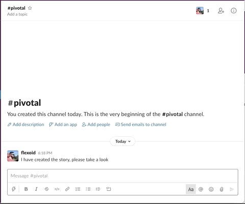

# Pivotal Tracker Slack Preview

Slack app that provides preview of the pivotal tracker stories when story URLs
are posted to the channels.



## Installation

1. Deploy this app using preferred way, you can refer to [Deployment](#deployment) section. The port needs to be publically available.
2. Go to Pivotal Tracker [profile](https://www.pivotaltracker.com/profile) page. Generate API token, use it as a `PIVOTAL_TOKEN` environment variable value.
3. Go to [My Apps](https://api.slack.com/apps) slack page and create new app. Choose the name (e.g "Pivotal Tracker Slack Preview") and select desired workspace.
4. On the Basic Information page, copy "Signing Secret" and use it as a `SLACK_SIGNING_SECRET` environment variable value.
5. Go to OAuth & Permissions page. Copy "Bot User OAuth Access Token" and use it as a `SLACK_TOKEN` value.
6. Add the following OAuth scopes:
   * `channels:history`
   * `channels:read`
   * `chat:write`
   * `groups:history`
   * `im:history`
7. Go to the Event Subscriptions page. Subscribe to the following bot events:
   * `message.channels`
   * `message.groups`
   * `message.im`
8. Enable events and configure Request URL in the form `http://<host>:<port>/events-endpoint`. It is more secure to use `https`, but it will require some reverse proxy with certificate configured.
9.  Go to Interactivity & Shortcuts page. Enable interactivity and add Request URL like `http://<host>:<port>/interactive-endpoint`.
10. Add app to the channel. In Slack open:
   * "Channel Details"
   * "(...) More"
   * "Add apps"
   * Find an app in a list

## Configuration

Environment variables:

* `PORT`
* `SLACK_TOKEN`
* `SLACK_SIGNING_SECRET`
* `PIVOTAL_TOKEN`

## Deployment

### Docker Compose

Edit `./configs/.env.prod` file to add all required configuration parameters.

Then run:

```console
$ docker-compose -f ./deployment/docker-compose.yml --env-file ./configs/.env.prod up -d
```

To update:

```console
$ docker-compose -f ./deployment/docker-compose.yml pull
$ docker-compose -f ./deployment/docker-compose.yml --env-file ./configs/.env.prod up --no-deps -d web
```
